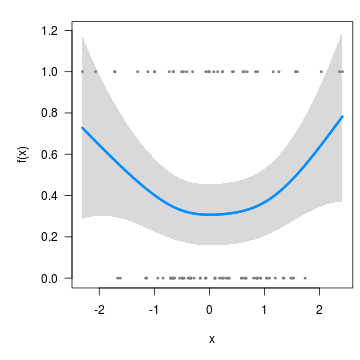
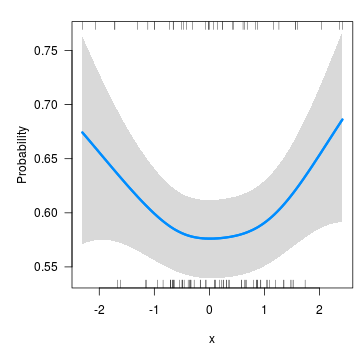

---
---

* TOC
{:toc}


This page contains miscellaneous questions that I have been asked about visreg, with answers posted here so that others can read them too.

# Q: In `visreg2d`, is it possible to superimpose data points onto the plot?

This is actually kind of complicated, just because of how `filled.contour()` works and the way in which it actually creates two plots, one main plot and one plot for the legend.  To superimpose a scatterplot onto the contour plot, you'll need to do something like this:


```r
fit <- lm(Ozone ~ Solar.R + Wind + Temp + I(Wind^2) + I(Temp^2) + I(Wind*Temp)+I(Wind*Temp^2) + 
          I(Temp*Wind^2) + I(Temp^2*Wind^2), data=airquality)
p <- quote({
  axis(1, at = mx, labels = lx)
  axis(2, at = my, labels = ly)
  with(airquality, points(Wind, Temp, pch=19))
})
visreg2d(fit, x="Wind", y="Temp", plot.type="image", plot.axes=p)
```


Doing this through the axes is admittedly very weird -- it's not my idea; see `?filled.contour`.  At one point I had experimented with having some options for this kind of thing in visreg2d, but could never arrive at a plot that looked good to me.

# Q: Does `visreg` work with `gamm` (mgcv) or `gamm4` objects?

Yes, although it takes a minor workaround since these objects have an unusual structure.  First, let's simulate some data and fit a model (I'm just using a `tibble` here for convenience, it isn't relevant to the question):


```r
library(mgcv)
library(tibble)
n <- 20
Data <- tibble(
  ID = factor(rep(LETTERS[1:n], each=5)),
  x  = rnorm(n*5),
  lp = rnorm(n)[as.numeric(ID)] + x^2 - 1,
  p  = binomial()$linkinv(lp),
  y  = rbinom(n*5, 1, p)
)
fit <- gamm(y~s(x), data=Data, dist='binomial', random=list(ID=~1))
```

Now, `fit$gam` does not include the call (i.e., `fit$gam$call` is `NULL`), which means `visreg` won't be able to find the data:


```r
visreg(fit$gam, 'x')
```

```
## Error in eval(inp, data, env): object 'y' not found
```

So you have to include it manually:


```r
fit$gam$data <- Data
visreg(fit$gam, 'x')
```



# Q: I'm getting the following error message: `Error in UseMethod("family") : no applicable method for 'family' applied to an object of class XXXX`.

When you specify `scale='response'`, you're telling `visreg` to automatically find the transformation mapping the linear predictor to the scale of the response.  It can only do that if the fitted model object provides that transformation through the `family()` method.  Many R models (e.g., `glm`) do this, but some (e.g., the `glmmADMB` package, `gamm` from the `mgcv` package) don't.  If you're working with one of these models, you'll have to supply that transformation yourself.  For example, with the model from the previous question, this code fails:


```r
visreg(fit$gam, 'x', scale='response')
```

```
## Error in UseMethod("family"): no applicable method for 'family' applied to an object of class "gam"
```

Since this is a binomial model with a logistic link, `binomial()$linkinv` provides the inverse transformation:


```r
visreg(fit$gam, 'x', trans=binomial()$linkinv, ylab="Probability")
```


