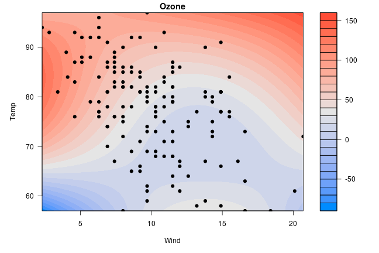

---
---


This page contains miscellaneous questions that I have been asked about visreg, with answers posted here so that others can read them too.

### Q: In `visreg2d`, is it possible to superimpose data points onto the plot?

This is actually kind of complicated, just because of how `filled.contour()` works and the way in which it actually creates two plots, one main plot and one plot for the legend.  To superimpose a scatterplot onto the contour plot, you'll need to do something like this:


```r
fit <- lm(Ozone ~ Solar.R + Wind + Temp + I(Wind^2) + I(Temp^2) + I(Wind*Temp)+I(Wind*Temp^2) + 
          I(Temp*Wind^2) + I(Temp^2*Wind^2), data=airquality)
p <- quote({
  axis(1, at = mx, labels = lx)
  axis(2, at = my, labels = ly)
  with(airquality, points(Wind, Temp, pch=19))
})
visreg2d(fit, x="Wind", y="Temp", plot.type="image", plot.axes=p)
```



Doing this through the axes is admittedly very weird -- it's not my idea; see `?filled.contour`.  At one point I had experimented with having some options for this kind of thing in visreg2d, but could never arrive at a plot that looked good to me.
