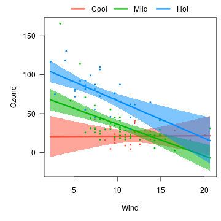

---
---


The default [cross-sectional plot](cross.html) places the different cross-sections in separate panels.  Occasionally, it is more helpful to overlay the plots on top of one another to see more directly how they compare.  Using the same model as [before](cross.html):


```r
airquality$Heat <- cut(airquality$Temp, 3, labels=c("Cool", "Mild", "Hot"))
fit <- lm(Ozone ~ Solar.R + Wind * Heat, data=airquality)
```

We can specify `overlay=TRUE` to obtain a version of the plot in which all the images are overlaid:


```r
visreg(fit, "Wind", by="Heat", overlay=TRUE)
```


